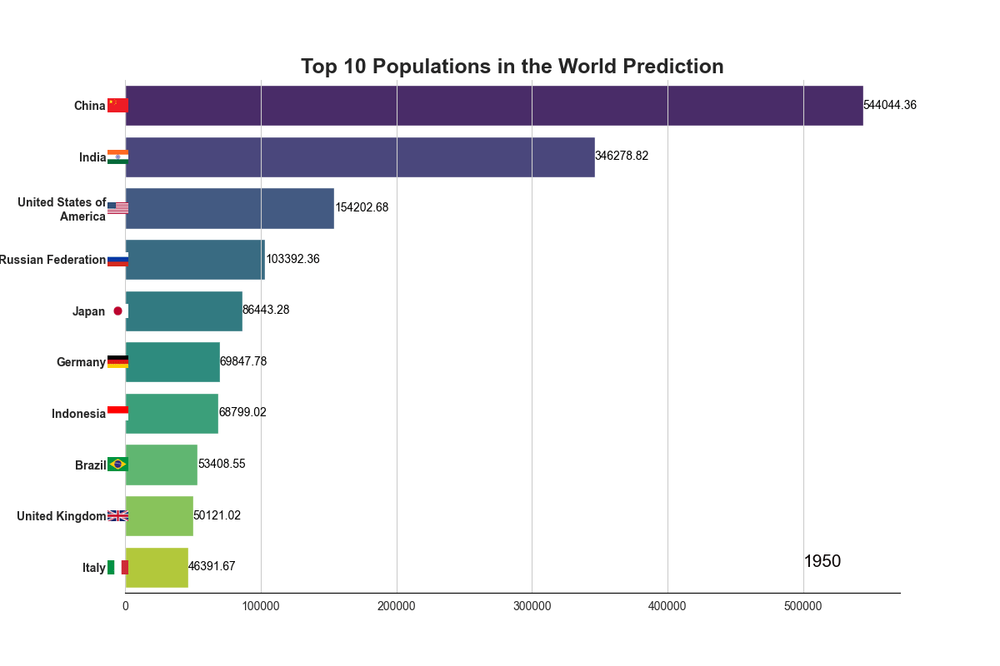

<h1 align="center">Barplot Time Series Animation Generator</h1>

<p align="center">
  
  
  
  
  
</p>

<p align="center">
  <strong> Link:</strong>  
  <a href="https://barplot-timeseries-animation-generator.streamlit.app/">
    https://barplot-timeseries-animation-generator.streamlit.app/
  </a><br>
  Upload your dataset and icons, and download the resulting MP4 animation.
</p>

---

##  Overview
This project is a **Streamlit web app** and **Python blueprint** for generating *animated bar chart races* that visualize how top categories evolve over time, similar to the popular **“bar chart race”** videos.

It’s designed to be modular, readable, and easily extensible into a fully automated program where you can simply provide a dataset with three key columns, and generate animations directly.

---
##  Example




The animation showcases the top entities per period (e.g., year), dynamically updating ranks, bars, and optional icons.
Use it for visualizing:

* Population growth by country
* Company revenues by year
* Product sales by month
* Sports or performance statistics
* Any time-based ranking visualization

---

## Features

-  **Animated barplots** over time (year, month, etc.)
-  **Modular structure** with reusable setup functions
-  **Parallel processing** to render and save animations simultaneously
- **Custom plot styling** via `setup_plotstyle()`
-  **Dynamic year label overlay** with `setup_year()`
-  **Automatic export** to `.mp4` using `ffmpeg`

---

## Requirements

If running locally, sure the following libraries are installed:

```bash
pip install -r requirements.txt
````

If you want to save animations as `.mp4`, you’ll also need **FFmpeg** installed on your system:

* Windows: [Download FFmpeg](https://ffmpeg.org/download.html)
* macOS (Homebrew): `brew install ffmpeg`
* Linux (Debian/Ubuntu): `sudo apt install ffmpeg`
---

##  Project Structure

```
barplot-timeseries-animation/
├── data/
│   └── clean-data.csv         # Dataset 
│   └── un-country-data.csv    # Raw data
├── animation.py               # Main script
├── README.md                  # Project documentation
└── requirements.txt           # Dependencies
```

---

##  Expected Data Format

Your CSV should include **three columns**:

| Column  | Description                               |
| ------- | ----------------------------------------- |
| `dt`    | Time unit (year, month, etc.)             |
| `label` | Category name (country, product, etc.)    |
| `x`     | Numeric value (population, revenue, etc.) |

Example:

| dt   | label | x         |
| ---- | ----- | --------- |
| 1950 | China | 554419000 |
| 1950 | India | 376325200 |
| 1950 | USA   | 157813000 |
| 1951 | China | 562388000 |
| 1951 | India | 382740000 |

---

##  Core Functions (in `main.py`)

| Function                                       | Description                                     |
| ---------------------------------------------- | ----------------------------------------------- |
| `load_icons(df, icon_folder, label_col)`       | Loads and resizes icons corresponding to labels |
| `add_icons(ax, icons)`                         | Draws icons next to bar labels                  |
| `draw_frame(ax, df, title, frame, icons, ...)` | Draws each frame of the animation               |
| `save_animation(df, frames, icons, ...)`       | Saves animation as `.mp4` using FFmpeg          |
| `show_animation(df, frames, icons, ...)`       | Displays animation interactively                |

---

##  How It Works

### 1. Data is filtered for each frame

```python
frame_data = df[df['dt'] == frame]
top_items = frame_data.nlargest(n_largest, 'x')
```

### 2. Bars are drawn with Seaborn

```python
sns.barplot(x='x', y='label', data=top_items, palette='viridis', ax=ax)
```

### 3. Optional icons are attached

```python
img = icons[label].convert("RGBA")
imagebox = OffsetImage(img, zoom=0.07)
```

### 4. Animation saved

```python
anim.save(os.path.join(output_path, "animation.mp4"), writer="ffmpeg", fps=fps)
```
---

##  Author

**Adan Siqueira**  
 [GitHub Profile](https://github.com/AdanSiqueira)

---

If you like this project, don’t forget to ⭐ star the repository to show your support!