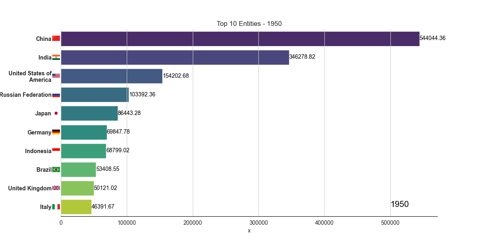

<h1 align="center">Barplot Time Series Animation Blueprint</h1>

<p align="center">
  
  
  
  
  
</p>

This project is a **Python blueprint for creating animated barplot time series visualizations** — similar to the popular “bar chart race” videos.  
It’s designed to be modular, readable, and easily extensible into a fully automated program where you can simply provide a dataset with two key columns, and generate animations directly.

---

##  Overview


The script demonstrates how to visualize the evolution of data across time by animating the **Top 10 entities per year (or any time frame)** using `Matplotlib`, `Seaborn`, and `FuncAnimation`.

While this version is focused on population data (countries over years), it serves as a **template** for any time-based ranking visualization, such as:

- Company revenues over years  
- City populations or temperatures  
- Product sales over months  
- Sports statistics (team scores, player performance, etc.)

---

## Features

-  **Animated barplots** over time (year, month, etc.)
-  **Modular structure** with reusable setup functions
-  **Parallel processing** to render and save animations simultaneously
- **Custom plot styling** via `setup_plotstyle()`
-  **Dynamic year label overlay** with `setup_year()`
-  **Automatic export** to `.mp4` using `ffmpeg`

---

## Requirements

Make sure the following libraries are installed:

```bash
pip install -r requirements.txt
````

If you want to save animations as `.mp4`, you’ll also need **FFmpeg** installed on your system:

* Windows: [Download FFmpeg](https://ffmpeg.org/download.html)
* macOS (Homebrew): `brew install ffmpeg`
* Linux (Debian/Ubuntu): `sudo apt install ffmpeg`

---

##  Project Structure

```
barplot-timeseries-animation/
├── data/
│   └── clean-data.csv         # Dataset 
│   └── un-country-data.csv    # Raw data
├── animation.py               # Main script
├── README.md                  # Project documentation
└── requirements.txt           # Dependencies
```

---

## Expected Data Format

The script assumes your dataset contains at least these **three columns**:

| Column Name       | Description                           |
| ----------------- | ------------------------------------- |
| `Time`            | Year or period of observation         |
| `TPopulation1Jan` | Value to visualize (e.g. population)  |
| `Location`        | Category / entity name (e.g. country) |

Example (`clean-data.csv`):

| Time | Location | TPopulation1Jan |
| ---- | -------- | --------------- |
| 1950 | China    | 554419000       |
| 1950 | India    | 376325200       |
| 1950 | USA      | 157813000       |
| 1951 | China    | 562388000       |
| 1951 | India    | 382740000       |
| ...  | ...      | ...             |

---

## How It Works

### 1. Load data

```python
pop_data = pd.read_csv('./data/clean-data.csv')
frames = pop_data['Time'].unique().tolist()
```

### 2. Display animation

The animation is shown in a live window (matplotlib GUI):

```python
show_animation(pop_data, frames)
```

### 3. Save animation

In parallel, a separate process saves the animation as `animation.mp4`:

```python
save_animation(pop_data, frames)
```

This dual-process setup lets you **watch the animation while it’s being rendered and saved**.

---

##  Functions Summary

| Function                     | Description                                    |
| ---------------------------- | ---------------------------------------------- |
| `setup_plotstyle(ax)`        | Applies a clean visual style to the chart      |
| `setup_year(ax, year)`       | Displays the current year label on the plot    |
| `save_animation(df, frames)` | Generates and saves the animation as `.mp4`    |
| `show_animation(df, frames)` | Displays the animation interactively           |
| `__main__`                   | Runs both visualization and saving in parallel |

---

##  Author

**Adan Siqueira**  
 [GitHub Profile](https://github.com/AdanSiqueira)

---